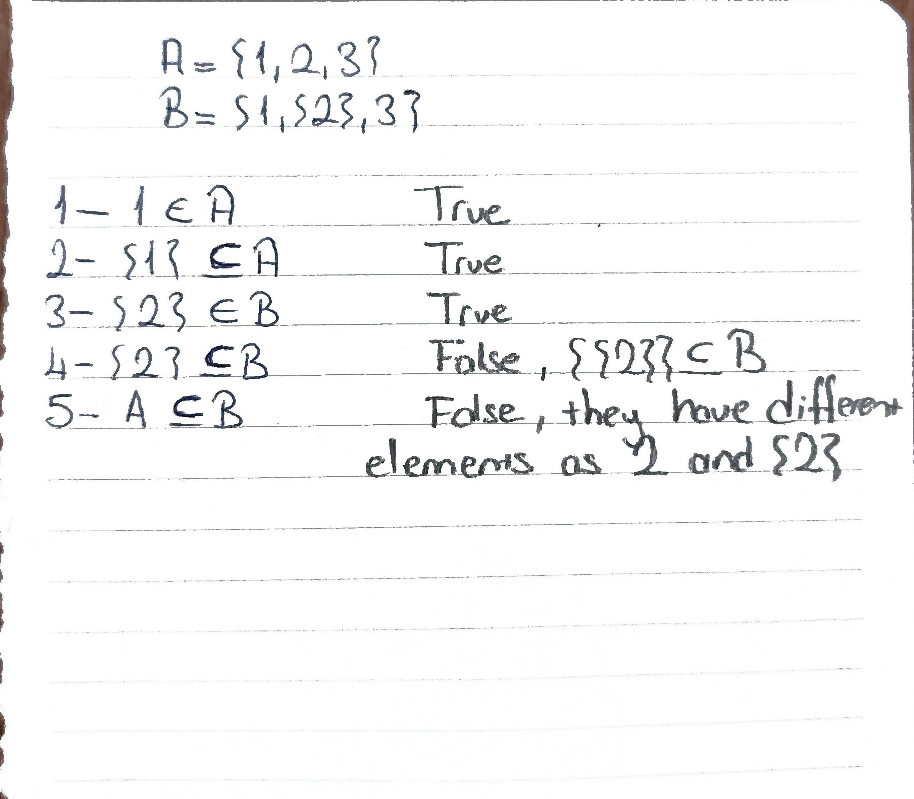
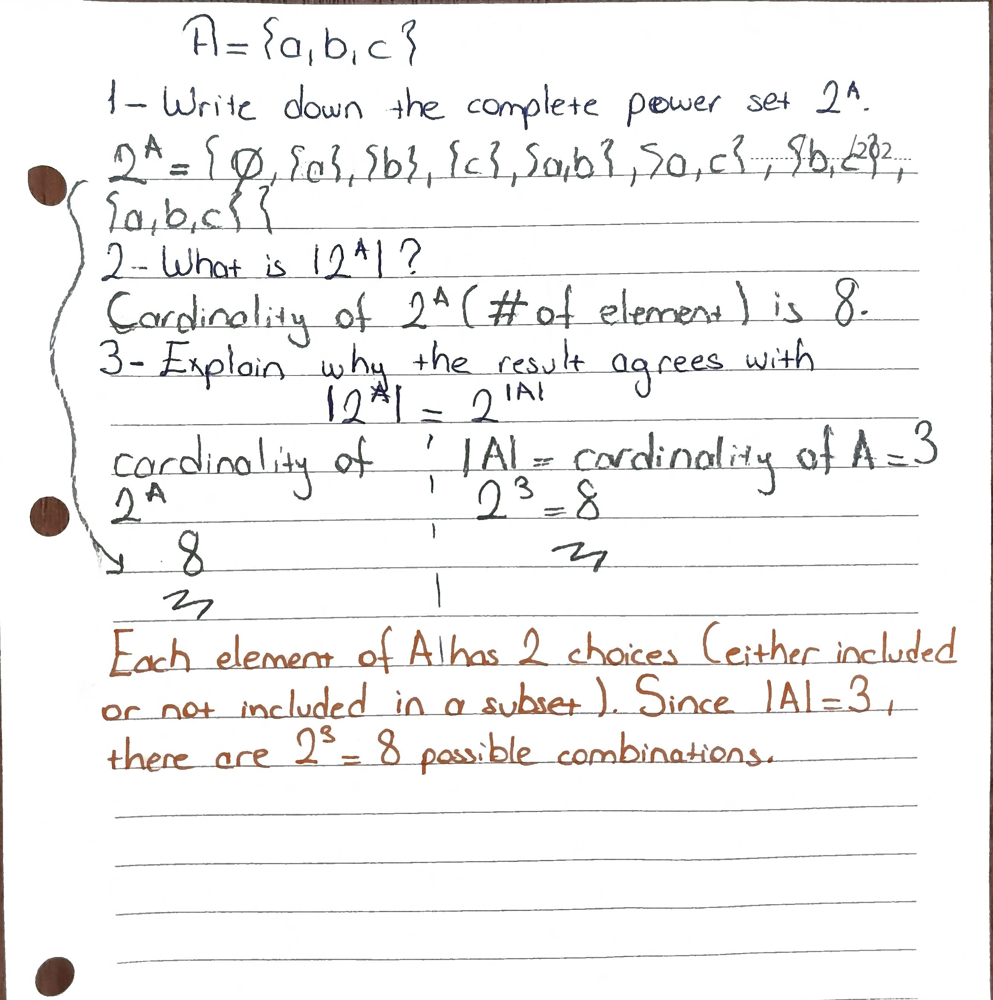
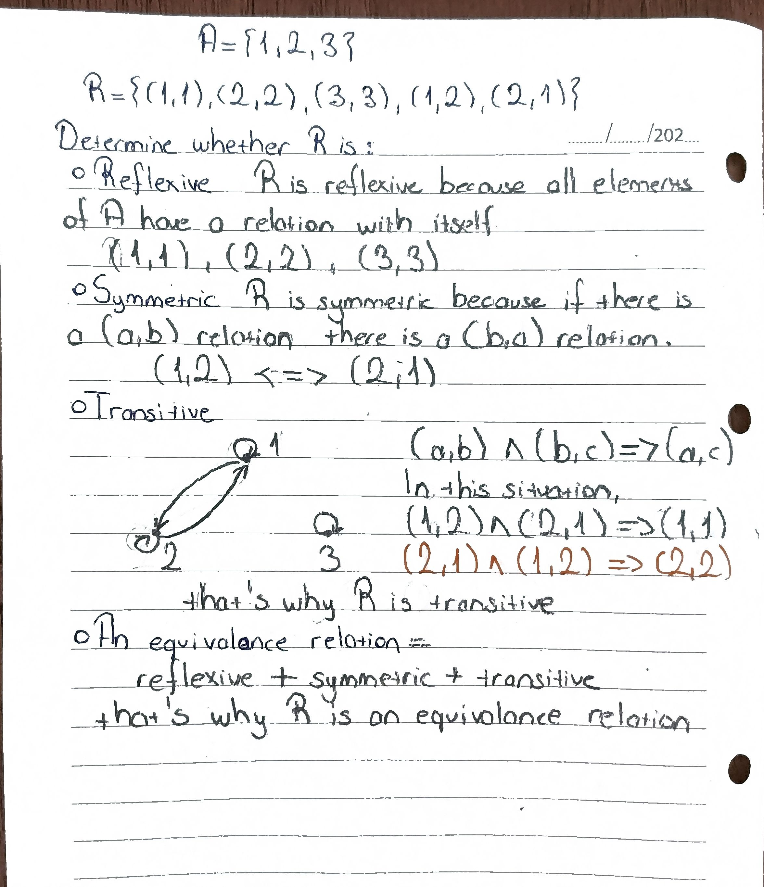
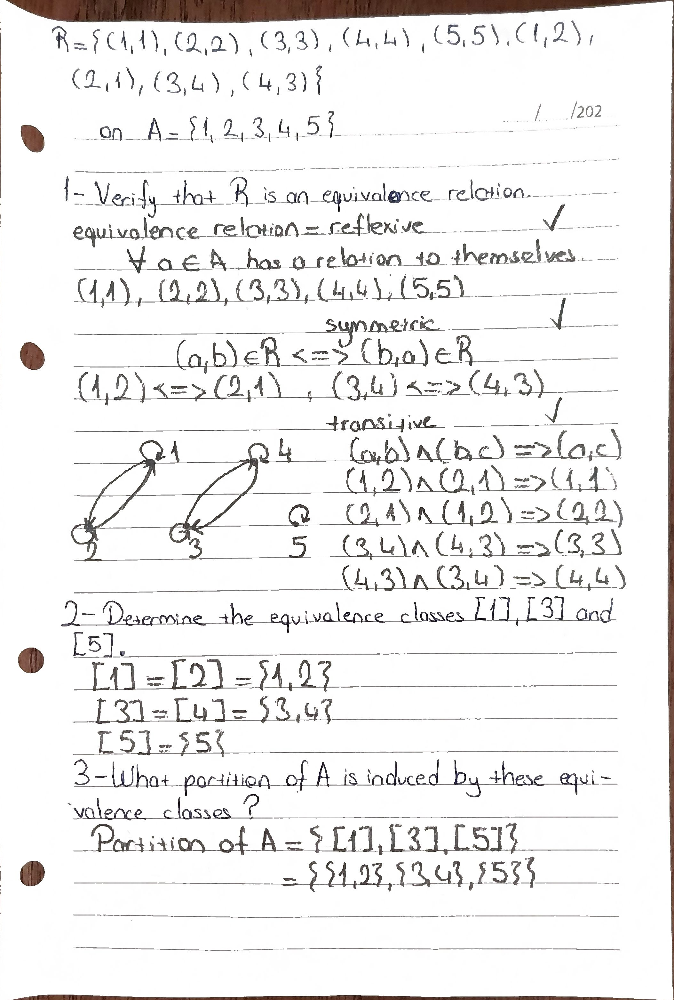
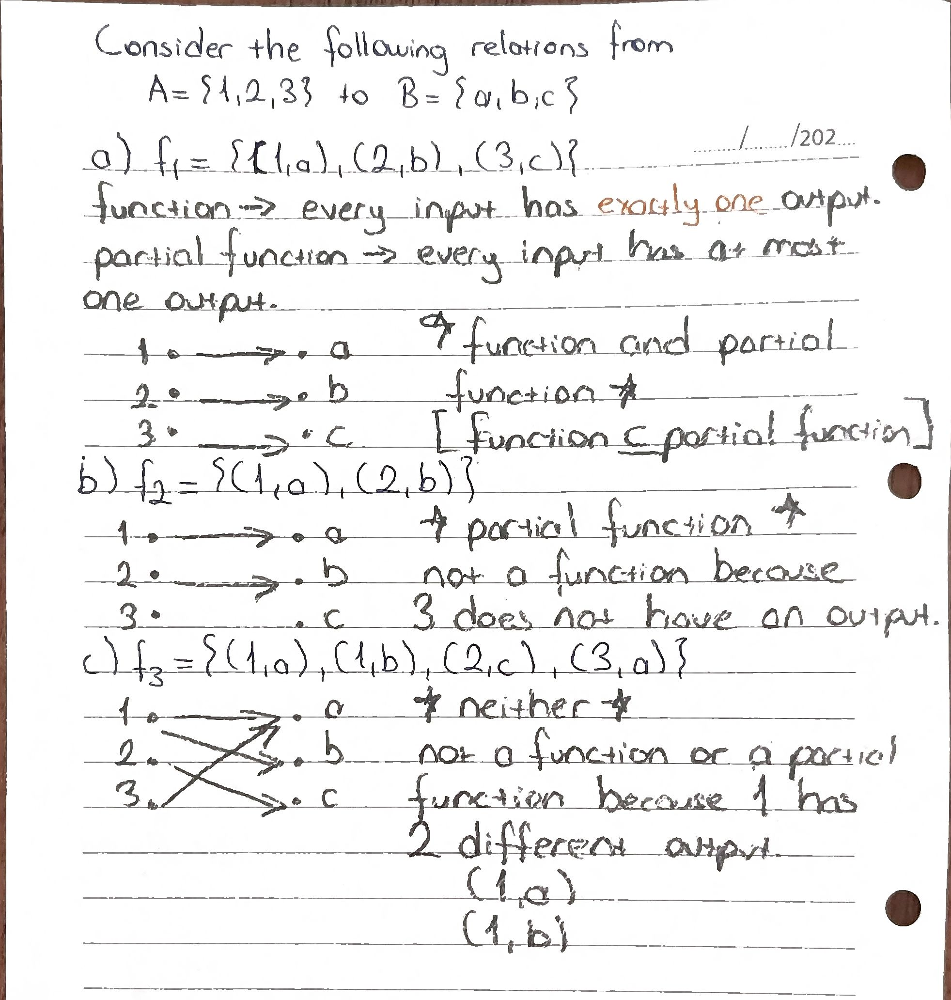
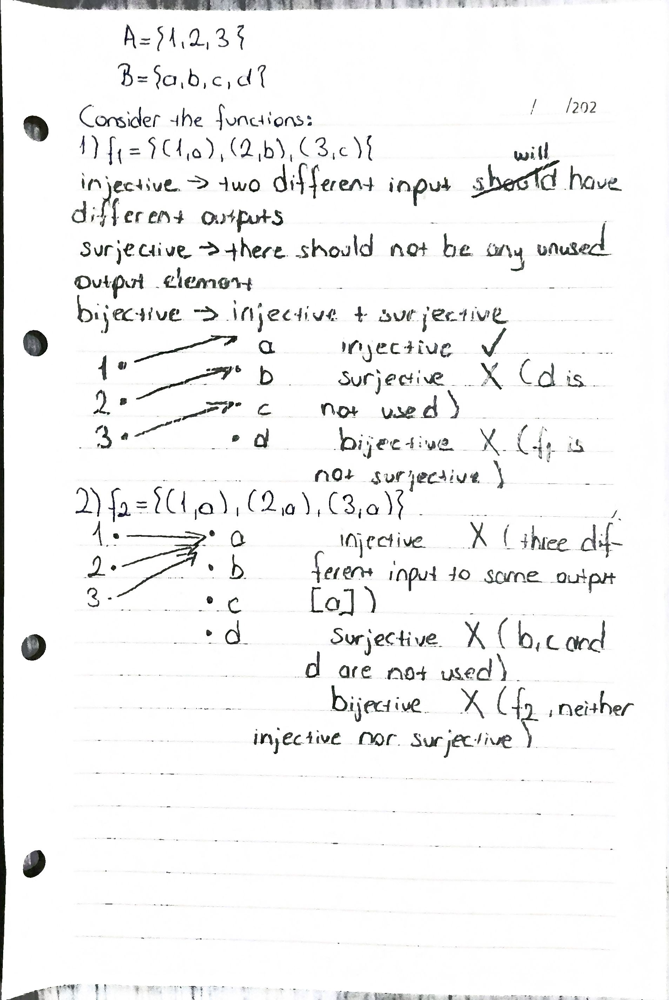
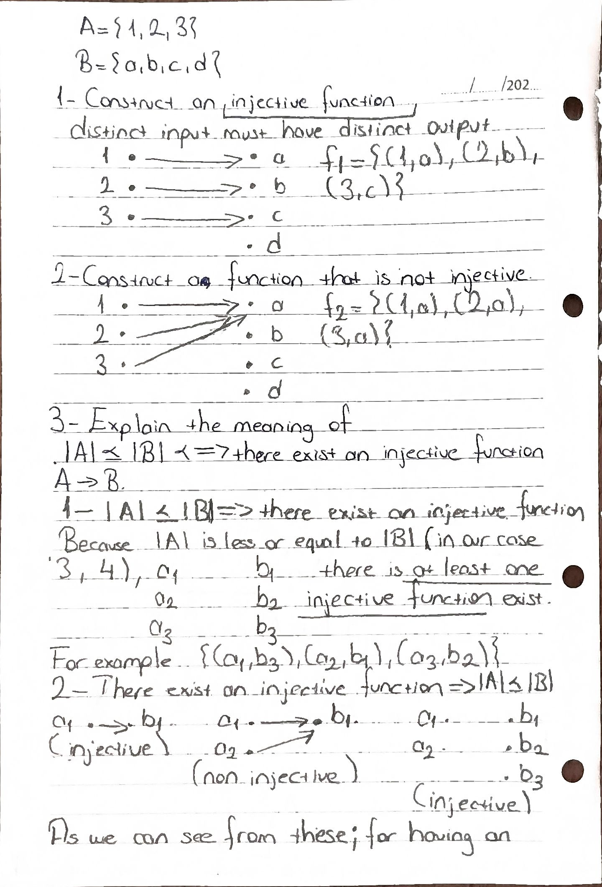
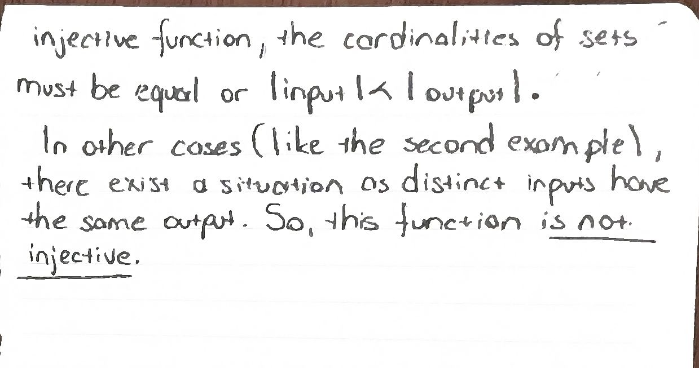
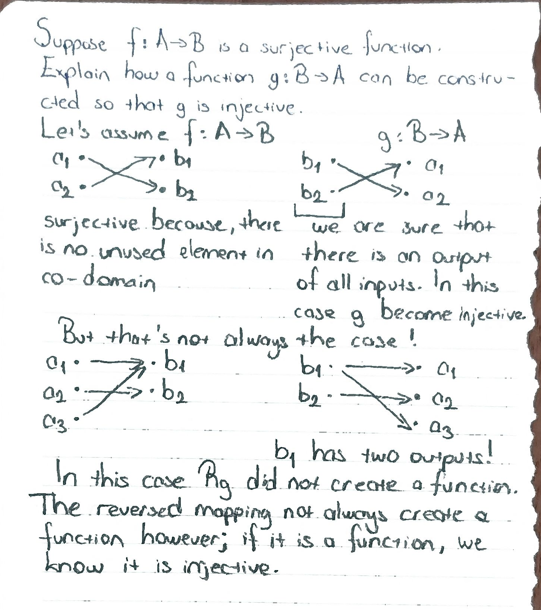

# Lecture 1 — Exercises

These exercises cover the main concepts introduced in Lecture 1:
sets, power sets, relations, equivalence relations, functions, injectivity, surjectivity, cardinality, and Cantor's theorem.

---

## Exercise 1 — Sets and Subsets

Let

$$
A = \{1,2,3\}
$$
$$
B = \{1,\{2\},3\}.
$$

For each statement, determine whether it is **true or false**.

1. $1 \in A$
2. $\{1\} \subseteq A$
3. $\{2\} \in B$
4. $\{2\} \subseteq B$
5. $A \subseteq B$

### Handwritten solution

---

## Exercise 2 — Power Set

Let

$$
A = \{a,b,c\}.
$$

1. Write down the complete power set $2^A$.
2. What is $|2^A|$?
3. Explain why the result agrees with

$$
|2^A| = 2^{|A|}.
$$

### Handwritten solution

---

## Exercise 3 — Relation Properties

Let

$$
A = \{1,2,3\}
$$

$$
R = \{(1,1),(2,2),(3,3),(1,2),(2,1)\}.
$$

Determine whether $R$ is:

- Reflexive
- Symmetric
- Transitive
- An equivalence relation

Give a short justification for each property.

### Handwritten solution

---

## Exercise 4 — Equivalence Classes

Consider the relation

$$
R = \{(1,1),(2,2),(3,3),(4,4),(5,5),
(1,2),(2,1),(3,4),(4,3)\}
$$

on

$$
A = \{1,2,3,4,5\}.
$$

1. Verify that $R$ is an equivalence relation.
2. Determine the equivalence classes $[1]$, $[3]$, and $[5]$.
3. What partition of $A$ is induced by these equivalence classes?

### Handwritten solution

---

## Exercise 5 — Function or Partial Function?

Consider the following relations from

$$
A = \{1,2,3\}
$$

to

$$
B = \{a,b,c\}.
$$

### (a)

$$
f_1 = \{(1,a),(2,b),(3,c)\}
$$

### (b)

$$
f_2 = \{(1,a),(2,b)\}
$$

### (c)

$$
f_3 = \{(1,a),(1,b),(2,c),(3,a)\}
$$

For each relation, determine whether it is:

- a function,
- a partial function,
- or neither.

Explain your reasoning.

### Handwritten solution

---

## Exercise 6 — Injective and Surjective Functions

Let

$$
A = \{1,2,3\}
$$

and

$$
B = \{a,b,c,d\}.
$$

Consider the functions:

$$
f_1 = \{(1,a),(2,b),(3,c)\}
$$

and

$$
f_2 = \{(1,a),(2,a),(3,a)\}.
$$

For each function, determine whether it is:

- injective,
- surjective,
- bijective.

Give a short justification.

### Handwritten solution

---

## Exercise 7 — Comparing Cardinalities

Let

$$
A = \{1,2,3\}
$$

and

$$
B = \{a,b,c,d\}.
$$

1. Construct an injective function

$$
f:A\rightarrow B.
$$

2. Construct a function that is **not** injective.

$$
g:A\rightarrow B
$$

3. Based on these examples, explain the meaning of

$$
|A| \leq |B|
\iff
\text{there exists an injective function } A\rightarrow B.
$$

### Handwritten solution

---

## Exercise 8 — Surjection and Injection

Suppose

$$
f:A\rightarrow B
$$

is a surjective function.

Explain how a function

$$
g:B\rightarrow A
$$

can be constructed so that $g$ is injective.

You do not need to give a fully formal proof, but clearly explain the idea.

### Handwritten solution

**!!There are wrong parts!!**

---

## Exercise 9 — Cantor's Theorem

Let

$$
h:A\rightarrow 2^A
$$

be any function.

Define

$$
\Delta_h =
\{a\in A\mid a\notin h(a)\}.
$$

1. Show that $\Delta_h\in 2^A$.
2. Explain why

$$
\Delta_h \neq h(a)
$$

for every $a\in A$.
3. What does this imply about $h$?
4. What does this prove about the cardinalities of $A$ and $2^A$?

### Handwritten solution

---

# Reflection

## 1. What I understood

Write 2–4 sentences about the concepts that you understand intuitively, not just by definition.

- Sets and subsets:
- Relations:
- Functions:
- Injective / surjective:
- Cardinality:
- Cantor's theorem:

---

## 2. One concept I initially misunderstood

<!-- Describe one misconception and how you corrected it. -->
- Proofs made with cardinalities

---

## 3. Things I still have doubts about

<!-- Write one concept/proof in your own words. -->
- Transitivity in some specific examples
- Cantor's theorem on proof of the cardinality of power set  
**!! When they solved, they will be deleted !!**

---

## Evidence

The handwritten solutions for selected exercises are included in the `images/` directory.

Selected exercises:

- Exercise 1 — Sets and subsets
- Exercise 2 — Power set
- Exercise 3 — Relation properties
- Exercise 4 — Equivalence classes
- Exercise 6 — Injective / surjective
- Exercise 7 — Cardinality
- Exercise 9 — Cantor's theorem